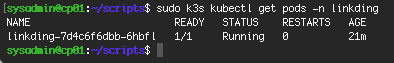
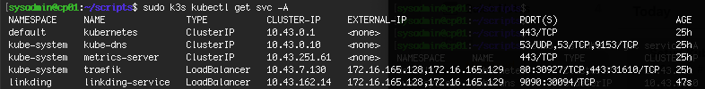
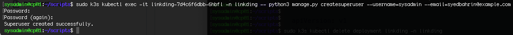
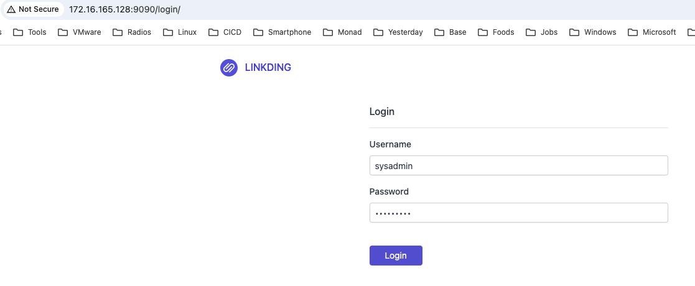
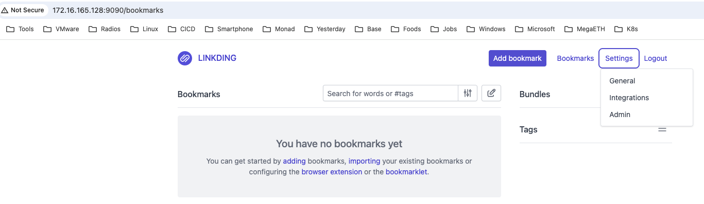

# Setup K3s nodes to deploy linkding
Macbook Air M2<br>
VMware-Fusion-13.6.4-24832108<br>
ubuntu-24.04.3-live-server-arm64.iso<br>

# VM information
| VM Name | Node status | OS | vCPU | RAM (GB) | HD (GB) | IP |
|---|---|---|---|---|---|---|
| cp01 | Control plane | Ubuntu 24.04.3 Minimal | 2 | 2 | 20 | 172.16.165.128 |
| wn01 | Worker | Ubuntu 24.04.3 Minimal | 2 | 2 | 20 | 172.16.165.129 |

# VMware Fusion main interface


# VM setting


# Update OS and then reboot VM
```cmd
sudo apt update && sudo apt upgrade -y
```
```cmd
sudo reboot now
```
# Configure /etc/hosts on both VMs, add two hostname 
172.16.165.128 cp01<br>
172.16.165.129 wn01

# Disable swap (required by Kubernetes)
```cmd
sudo swapoff -a
```
```cmd
sudo sed -i '/swap/d' /etc/fstab
```
# Install K3s on Master node
```cmd
curl -sfL https://get.k3s.io | sh -
```
Run below command to check node status
```cmd
sudo k3s kubectl get nodes
```
# Copy token for next step
```cmd
sudo cat /var/lib/rancher/k3s/server/node-token
```
# Install k3s on Worker node
```cmd
curl -sfL https://get.k3s.io | K3S_URL=https://<ip_master_node>:6443 K3S_TOKEN=Token_master_node sh -
```
Run below command on control plane node to check node status
```cmd
sudo k3s kubectl get nodes
```
# Deploy linkding
Create a yaml file deploy_linkding.yaml deploy linkding

```yaml
apiVersion: v1
kind: Namespace
metadata:
  name: linkding
---
apiVersion: apps/v1
kind: Deployment
metadata:
   name: linkding
   namespace: linkding
spec:
  replicas: 1
  selector:
    matchLabels:
      app: linkding
  template:
    metadata:
      labels:
        app: linkding
    spec:
      containers:
        - name: linkding
          image: sissbruecker/linkding:1.44.1
          ports:
            - containerPort: 9090 
```
Run below command to deploy linkding
```cmd
sudo k3s kubectl apply -f deploy_linkding.yaml
```
Run below command to check linkding pod
```cmd
sudo k3s kubectl get pods -n linkding
```


# Create port forward
```cmd
sudo k3s kubectl port-forward pod/linkding-7d4c6f6dbb-6hbfl 9090:9090 -n linkding
```
# Create service for linkding
Create a yaml file svc_linkding.yaml to deploy service
```yaml
apiVersion: v1
kind: Service
metadata:
  name: linkding-service
  namespace: linkding
spec:
  type: LoadBalancer
  selector:
    app: linkding
  ports:
    - port: 9090
      targetPort: 9090
      protocol: TCP
      name: http
```
Run below command to deploy service
```cmd
sudo k3s kubectl apply -f svc_linkding.yaml
```
Run below command to check service
```cmd
sudo k3s kubectl get svc -A
```


# Setup administrator account for linkding
```cmd
sudo k3s kubectl  exec -it linkding-7d4c6f6dbb-6hbfl -n linkding -- python3 manage.py createsuperuser --username=sysadmin --email=syedbahrin@example.com
```
Enter password<br>


# Access linkding page using superuser credential


# In superuser profile page


