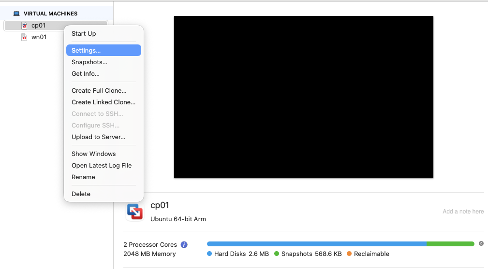
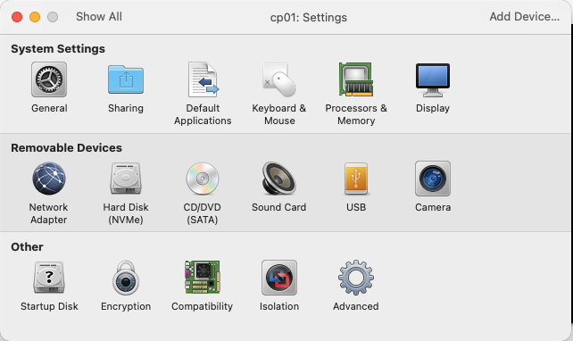

Setup K3s to deploy linkding.  
Macbook Air M2.  
VMware Fusion.  
OS Ubuntu 24.04.3 Minimal.  
K3s with 2 nodes, 1 control plane / master node and 1 worker node.  
Create VM  
2 VM  
First VM hostname - cp01  
Second VM hostname - wn01    
OS   : Ubuntu 24.04.3 Minimal  
vCPU : 2  
RAM  : 2GB  
HD   : 20GB  
VMware Fusion  
  
VM setting  

